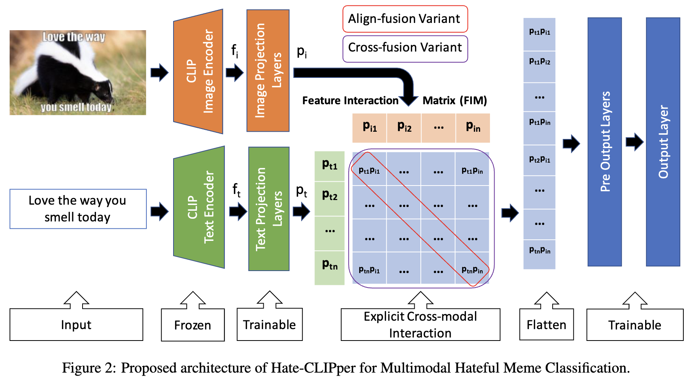
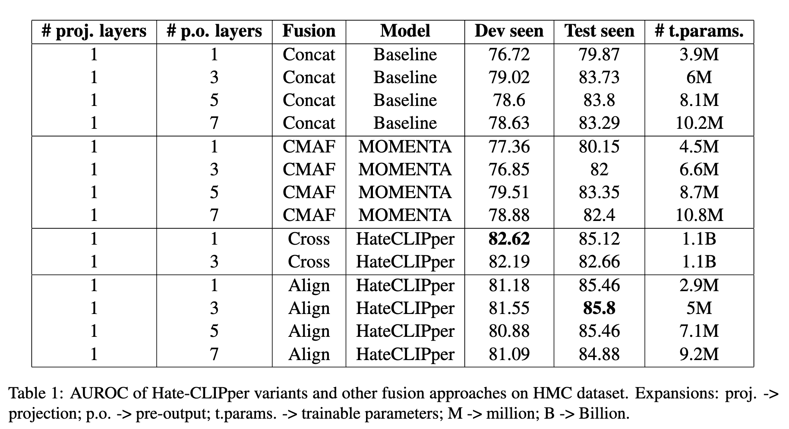
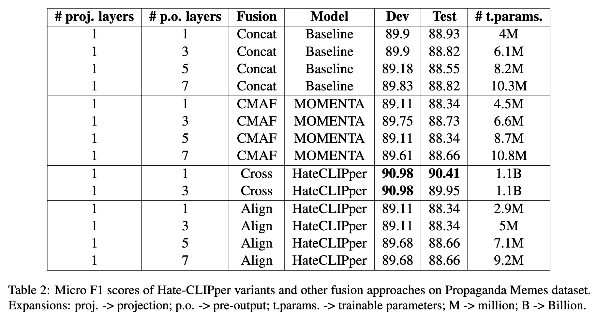
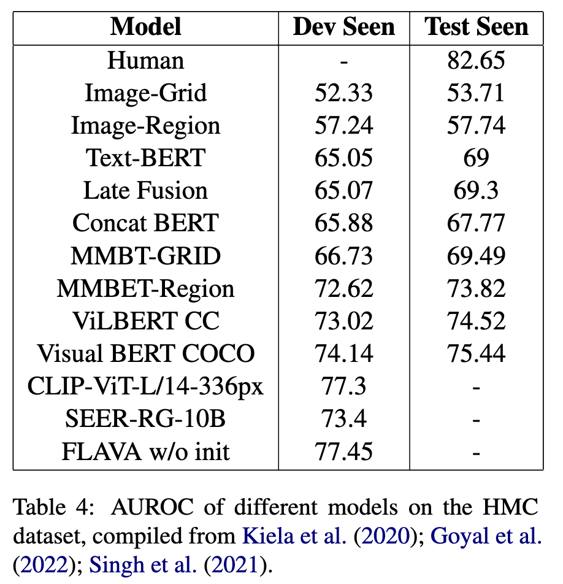
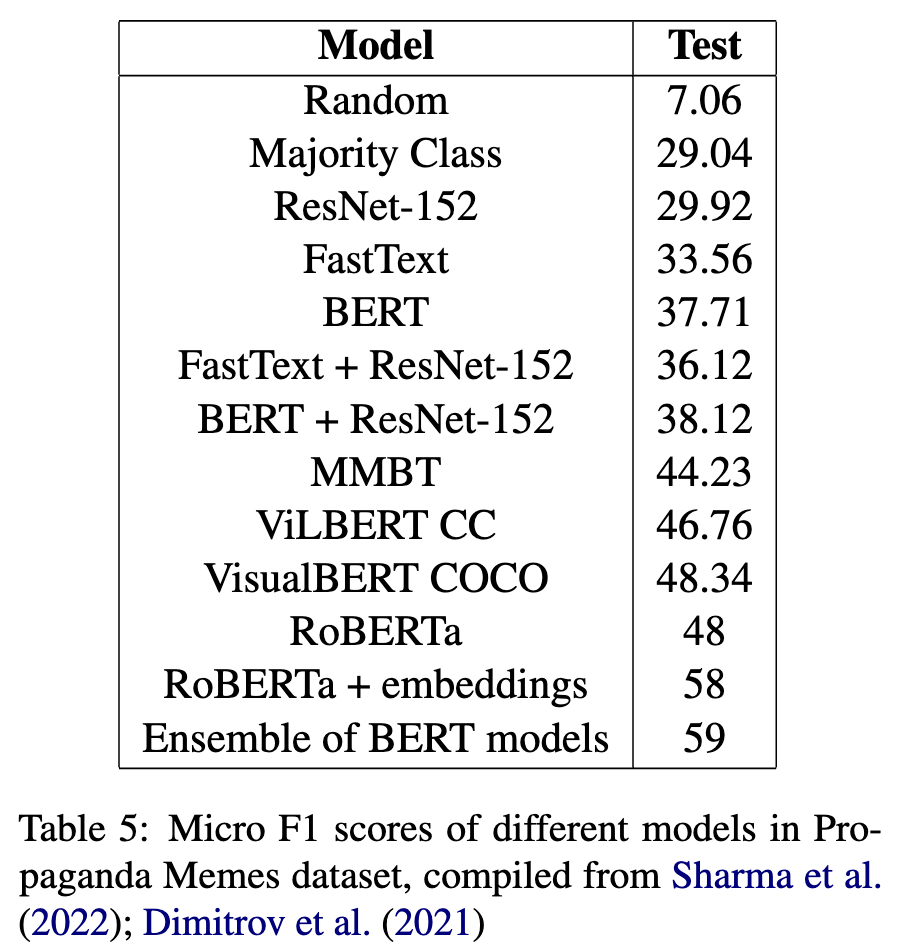

# Hate-CLIPper: Multimodal Hateful Meme Classification with Explicit Cross-modal Interaction of CLIP features

> 🎉 Accepted at [EMNLP 2022](https://2022.emnlp.org/) [Workshop on NLP for Positive Impact](https://sites.google.com/view/nlp4positiveimpact)

Hateful memes are a growing menace on social media. While the image and its corresponding text in a meme are related, they do not necessarily convey the same meaning when viewed individually. Hence, detecting hateful memes requires careful consideration of both visual and textual information. Multimodal pre-training can be beneficial for this task because it effectively captures the relationship between the image and the text by representing them in a similar feature space. Furthermore, it is essential to model the interactions between the image and text features through intermediate fusion. Most existing methods either employ multimodal pre-training or intermediate fusion, but not both. In this work, we propose the Hate-CLIPper architecture, which explicitly models the cross-modal interactions between the image and text representations obtained using Contrastive Language-Image Pre-training (CLIP) encoders via a feature interaction matrix (FIM). A simple classifier based on the FIM representation is able to achieve state-of-the-art performance on the Hateful Memes Challenge (HMC) dataset with an AUROC of 85.8, which even surpasses the human performance of 82.65. Experiments on other meme datasets such as Propaganda Memes and TamilMemes also demonstrate the generalizability of the proposed approach. Finally, we analyze the interpretability of the FIM representation and show that cross-modal interactions can indeed facilitate the learning of meaningful concepts. The code for this work is available at https://github.com/gokulkarthik/hateclipper.

**TL;DR:** We achieve SOTA performance in Hateful Meme Classification with a simple classifier on top of the cross/align fusion of CLIP features.

**[[ArXiv Preprint (TBD)](#)] [[ACL Anthology (TBD)](#)] [[EMNLP 2022 Poster (TBD)](#)]**

**Bibtex**:
```
@inproceedings{kumar-etal-2022-mucot,
    title = "Hate-CLIPper: Multimodal Hateful Meme Classification with Explicit Cross-modal Interaction of CLIP features",
    author = "Kumar, Gokul Karthik  and
      Nandakumar, Karthik",
    booktitle = "Proceedings of the Second Workshop on Workshop on NLP for Positive Impact",
    month = december,
    year = "2022",
    address = "Abu Dhabi, UAE",
    publisher = "Association for Computational Linguistics",
    abstract = "Hateful memes are a growing menace on social media. While the image and its corresponding text in a meme are related, they do not necessarily convey the same meaning when viewed individually. Hence, detecting hateful memes requires careful consideration of both visual and textual information. Multimodal pre-training can be beneficial for this task because it effectively captures the relationship between the image and the text by representing them in a similar feature space. Furthermore, it is essential to model the interactions between the image and text features through intermediate fusion. Most existing methods either employ multimodal pre-training or intermediate fusion, but not both. In this work, we propose the Hate-CLIPper architecture, which explicitly models the cross-modal interactions between the image and text representations obtained using Contrastive Language-Image Pre-training (CLIP) encoders via a feature interaction matrix (FIM). A simple classifier based on the FIM representation is able to achieve state-of-the-art performance on the Hateful Memes Challenge (HMC) dataset with an AUROC of 85.8, which even surpasses the human performance of 82.65. Experiments on other meme datasets such as Propaganda Memes and TamilMemes also demonstrate the generalizability of the proposed approach. Finally, we analyze the interpretability of the FIM representation and show that cross-modal interactions can indeed facilitate the learning of meaningful concepts. The code for this work is available at https://github.com/gokulkarthik/hateclipper.",
}
```
---


<br>

# Hate-CLIPper


# Results


<p float="left">


</p>


